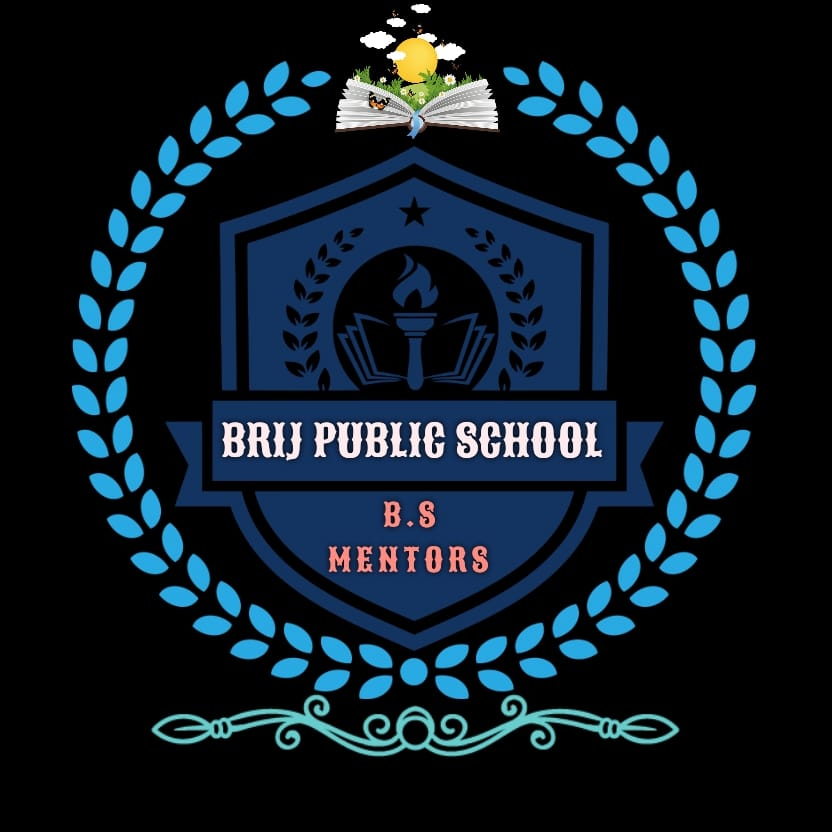

<!DOCTYPE html>
<html>

<head>
  <meta charset="utf-8">
  <meta name="viewport" content="width=device-width">
  <title>replit</title>
  <link href="style.css" rel="stylesheet" type="text/css" />
  
</head>

<body>

  

    
    <h2>BRIJ PUBLIC SCHOOL</h2>
    <ul class="nav">
      <li><a href="https://www.icbse.com/schools/brij-public-school-hodal-3pv9q">HOME</a></li>
      <li><a
          href="https://www.justdial.com/Palwal/Brij-Public-School-YC-Mohalla-Hodal-Rural-Hodal/9999P1275-1275-190419124838-K4U2_BZDET">About</a>
      </li>
      <li><a href="https://schools.org.in/palwal/06211705026/brij-public-school-hodal.html">Academics</a></li>
      <li><a href="https://vidhyant.com/schools/1113259/Brij-Public-School-Hodal">Admissions</a></li>
      <li>+919416477145</li>
    </ul>
  

  

    

      <h3>News and Events</h3>
      <ul>
        <li><a href="file:///C:/Users/User/OneDrive/Desktop/html/brijpublicschool.html#">Annual Day Celebration</a></li>
        <li><a href="file:///C:/Users/User/OneDrive/Desktop/html/brijpublicschool.html#">Sports Day</a></li>
        <li><a href="file:///C:/Users/User/OneDrive/Desktop/html/brijpublicschool.html#">Science Fair</a></li>
        <li><a href="file:///C:/Users/User/OneDrive/Desktop/html/brijpublicschool.html#">Cultural Fest</a></li>
        <li><a href="file:///C:/Users/User/OneDrive/Desktop/html/brijpublicschool.html#">Parent-Teacher Meeting</a></li>
      </ul>
    

    

      <h2>Welcome to Brij Academics Council.</h2>
      
Brij Public School Hodal is a co-educational school located in Hodal Tehsil, Haryana, India. The school was
        established in 1997 and is managed by the Pvt. Unaided. It offers education from grades 1 to 8 and has an
        attached pre-primary section. The school is dedicated to providing quality education to students of all ages and
        has highly qualified teachers who are committed to providing quality education to their students.

      
To apply for admission to the school, you can visit the schools website or contact the school directly to
        obtain the application form. The application form must be filled out completely and submitted along with the
        required documents and fees. The school will then review your application and notify you of the admission
        decision.

    

  

      <!-- Your website content goes here -->

      <footer>
          

            <b><a href="form.html">REGISTER HERE!!!</a></b>
          

         
          

              

                  <h2>Quick Links</h2>
                  <ul>
                      <li><a href="#">Home</a></li>
                      <li><a href="#">About Us</a></li>
                      <li><a href="#">Academics</a></li>
                      <li><a href="#">Admissions</a></li>
                      <li><a href="#">Contact Us</a></li>
                  </ul>
              

              

                  <h2>Programs</h2>
                  <ul>
                      <li><a href="#">Elementary School</a></li>
                      <li><a href="#">Middle School</a></li>
                      <li><a href="#">High School</a></li>
                      <li><a href="#">Extracurriculars</a></li>
                  </ul>
              

              

                  <h2>Contact Us</h2>
                  
y-c colony Hodal 121106, HARYANA Email:brijpublicschoolhodal@gmail.com  Phone:+91 9416477145, +91 8168926020

              

              

                  <h2>Follow Us</h2>
                  

                      <a href="#" target="_blank">Facebook</a>
                      <a href="#" target="_blank">Twitter</a>
                      <a href="#" target="_blank">Instagram</a>
                  

              

          

          
&copy; 2024 BRIJ PUBLIC SCHOOL {HODAL}. All rights reserved.

      </footer>

 
  
</body>

</html>
